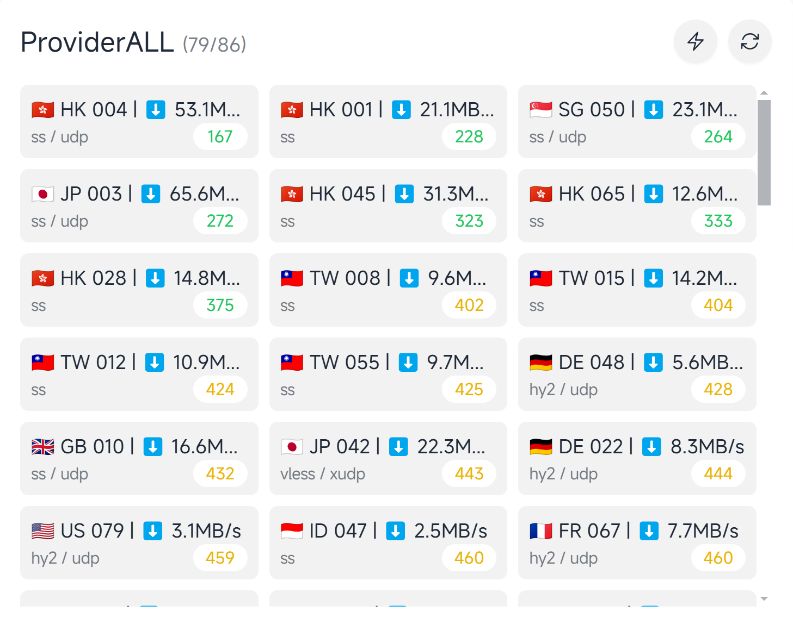
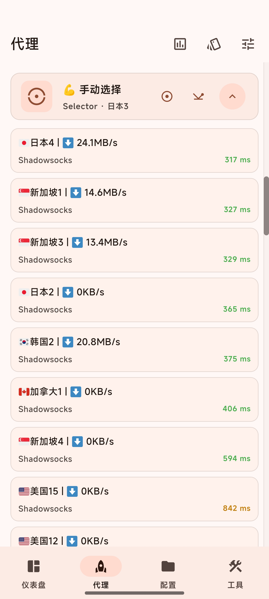

# 订阅合并转换检测工具

## 预览




## 功能

- 检测节点可用性,去除不可用节点
- 检测平台解锁情况
    - openai
    - youtube
    - netflix
    - disney
- 合并多个订阅
- 将订阅转换为clash/mihomo格式
- 节点去重
- 节点重命名
- 节点测速
- 根据解锁情况分类保存

## 特点

- 支持多平台
- 支持多线程
- 资源占用低

## TODO

- [x] 适配多种订阅格式
- [ ] 支持更多的保存方式
    - [x] 本地
    - [x] cloudflare r2
    - [x] gist
    - [x] webdav
    - [ ] 其他

## 使用方法

### Docker

```bash
docker run -itd \
    --name mihomo-check \
    -v /path/to/config:/app/config \
    --restart=always \
    ghcr.io/bestruirui/subs-check
```

### 源码直接运行

```bash
go run main.go -f /path/to/config.yaml
```

### 二进制文件运行

直接运行即可,会在当前目录生成配置文件

## 保存方法配置

- 本地保存: 将结果保存到本地,默认保存到可执行文件目录下的 output 文件夹
- r2: 将结果保存到 cloudflare r2 存储桶 [配置方法](./doc/r2.md)
